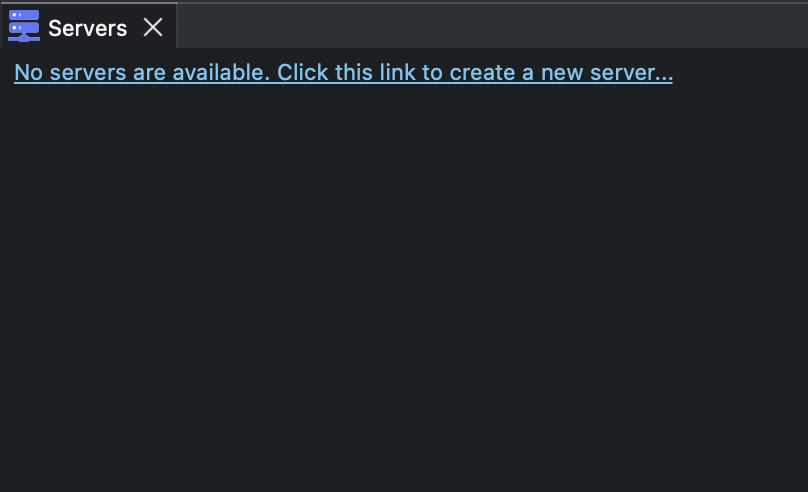
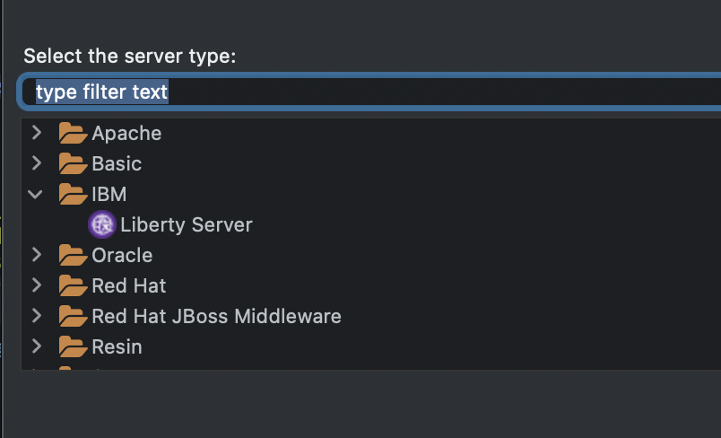
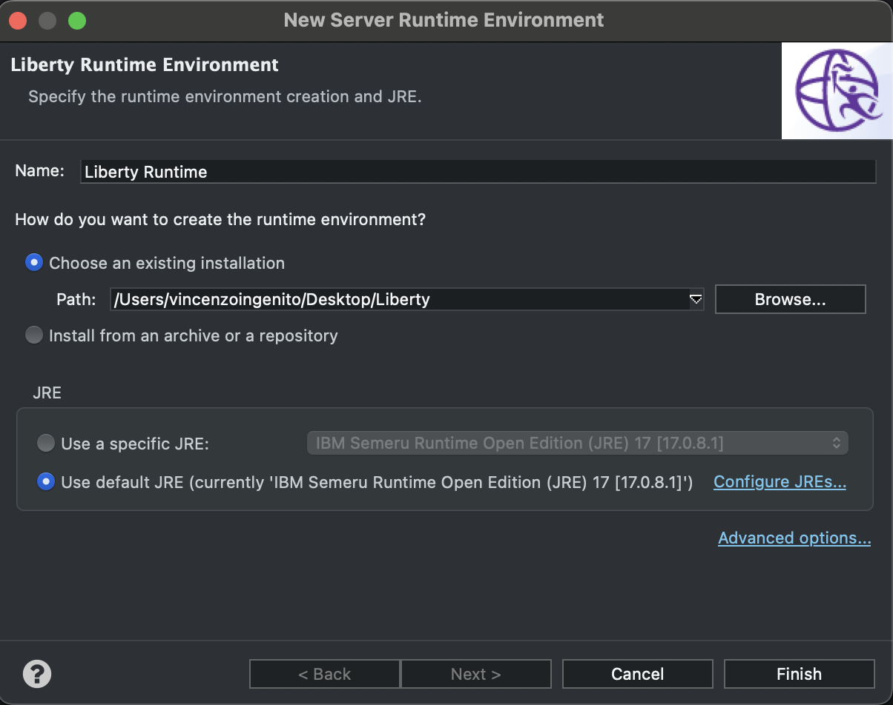
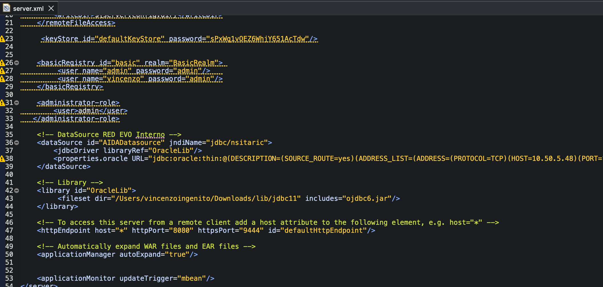
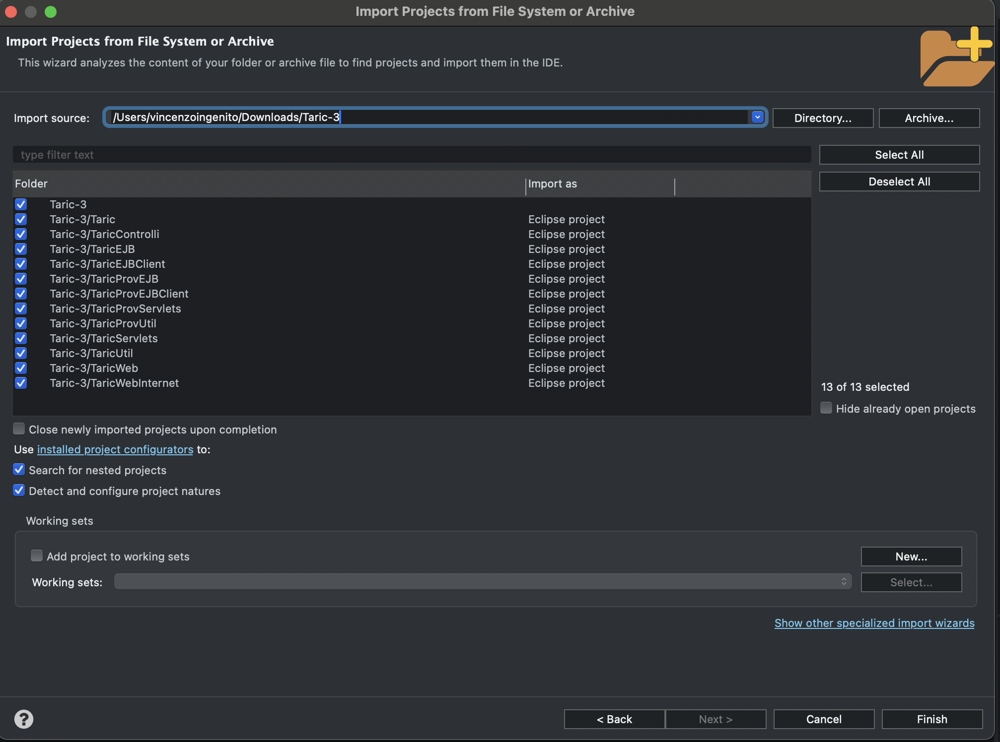
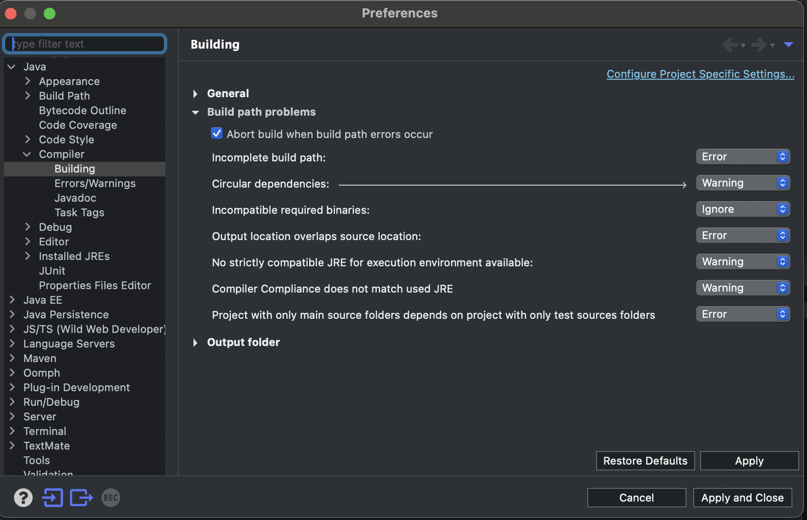
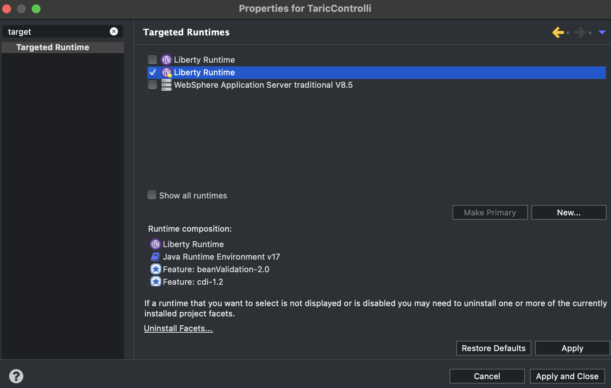
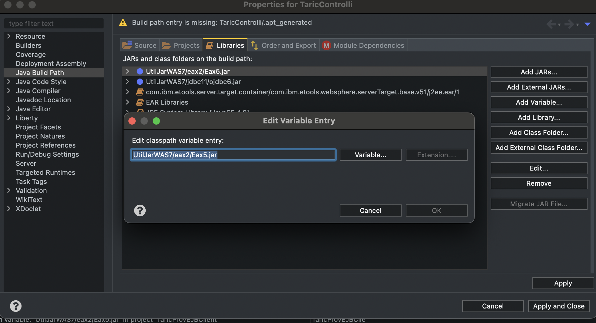
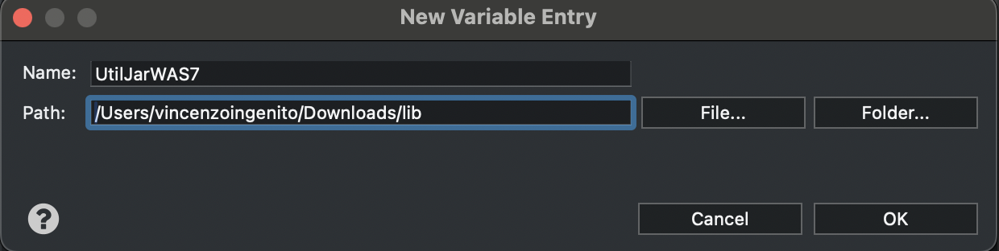
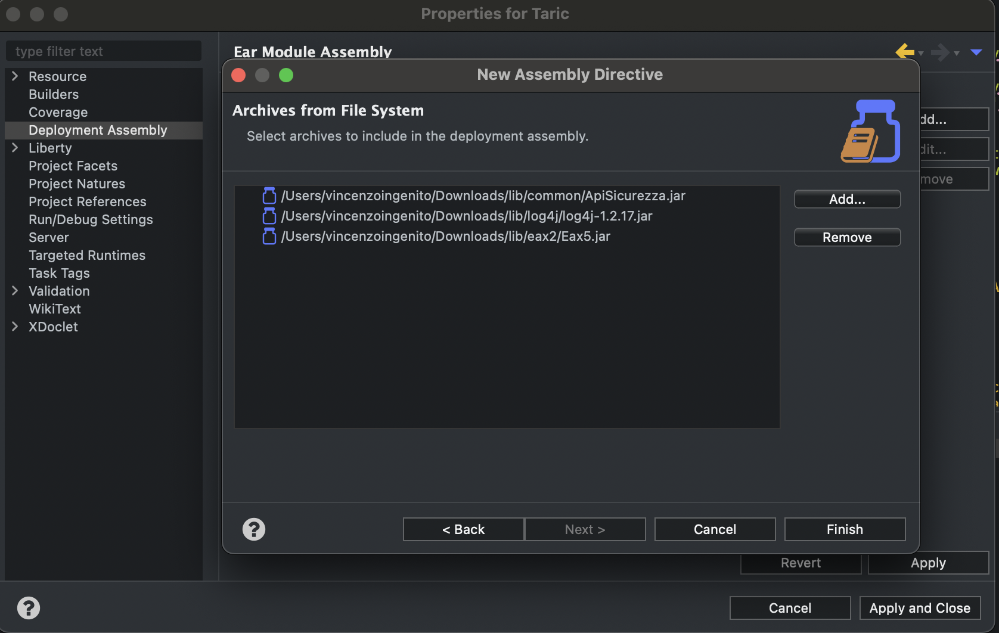

## Prerequisiti

Di seguito la lista del materiale da scaricare in via preliminare per lo start del progetto aida in locale:

- [IDE](https://www.eclipse.org/downloads/packages/release/2023-03/r)
- [Application server Liberty](https://ibm.ent.box.com/file/1516527047566)
- [Jars](https://ibm.ent.box.com/folder/261262566870)
- [Settings.xml](https://ibm.ent.box.com/file/1510755157926?s=gf9h99nk10ql07260gt7jj3unh21ibal)

Dopo aver eseguito il download è necessario configurare l'application server all'interno del proprio IDE. Per questa guida è stato utilizzato **Eclipse 2023‑03**.

1) Aggiungere la scheda Servers al proprio IDE e cliccare sul link relativo:

 

2) Cliccare sul server Liberty Server:

 

3) Configurare il server Liberty facendolo puntare alla folder scaricata in precedenza:

 

4) Modificare il file server.xml cambiando il puntamento dell'Oracle Lib; Se il sistema operativo windows il puntamento deve avere la seguente forma: **C:\\Users\\vingenito\\Desktop**

 
 
### Progetto

Eseguire il download del progetto presente al seguente indirizzo:

- [TARIC](https://ibm.ent.box.com/file/1529303094964)

### Compilazione progetti
Eseguire l'estrazione dello zip scaricato del [punto precedente](#Progetto) ed eseguire l'import nel proprio IDE.

Dopo l'import dei progetti, l'IDE mostrerà diversi errori nella scheda **Problems**. 

Di seguito viene fornita una panoramica degli errori riscontrati con la rispettiva risoluzione:

:::danger[ERRORE 1]
**One or more cycles were detected in the build path of project...**

:::

:::tip[RISOLUZIONE 1]
Declassare a warning

:::

 
   
:::danger[ERRORE 2]
**Target runtime WebSphere Application Server traditional V8.5 is not defined.**

:::

:::tip[RISOLUZIONE 2]
Cambiare il targeted runtime nei progetti per cui si ha l'errore ed impostarlo con Liberty invece che WAS

:::

:::danger[ERRORE 3]
**Unbound classpath variable: 'UtilJarWAS7/...in project**

:::

:::tip[RISOLUZIONE 3]
Per risolvere tale problematica può essere creata una variabile d'ambiente che punta alla folder di cui sopra:

Successivamente cliccare **Variable** e nella popup che si apre fare click sul tasto *+New** e valorizzare la variabile nel modo seguente:

:::

:::danger[ERRORE 4]
**DuplicateKeyException cannot be resolved to a type**

:::

:::tip[RISOLUZIONE 4]
Tale eccezione non risulta essere presente in Liberty ma solo in WAS, per cui è necessario commentare i pezzi di codice in cui è definita tale eccezione.

:::

:::danger[ERRORE 5]
**Return type for the method is missing	**LiquidDirittiAccess.java****

:::

:::tip[RISOLUZIONE 5]
Sostituire correttamente il carattere decodificato male
:::

:::danger[ERRORE 6]
**The method checkAmmissibilita(String, String, String, String, (((form.getTotFattura() == null) || "".equals(form.getTotFattura())) ? "0" : form.getTotFattura()), String) is undefined for the type**

:::

:::tip[RISOLUZIONE 6]
Commentare l'implementazione del metodo imponendo un return null, in quanto tale metodo è presente in un oggetto importato tramite un jar generato con un carattere decodificato male.
:::

## Esecuzione

1. Aggiungere i seguenti jars al progetto EAR:

2. Modificare in maniera hardcoded i puntamenti del database

3. Startare la VPN

4. Startare il server

:::tip[RUNTIME ERRORS LOG]
1. Puntando da un browser alla url presente in console allo starting del server, si avranno in console dei null pointer, dovuti alla mancanza di un file di **log.properties**. Per risolvere tale problematica è necessario modificare il valore della mappa con un valore hardcoded.
 
:::